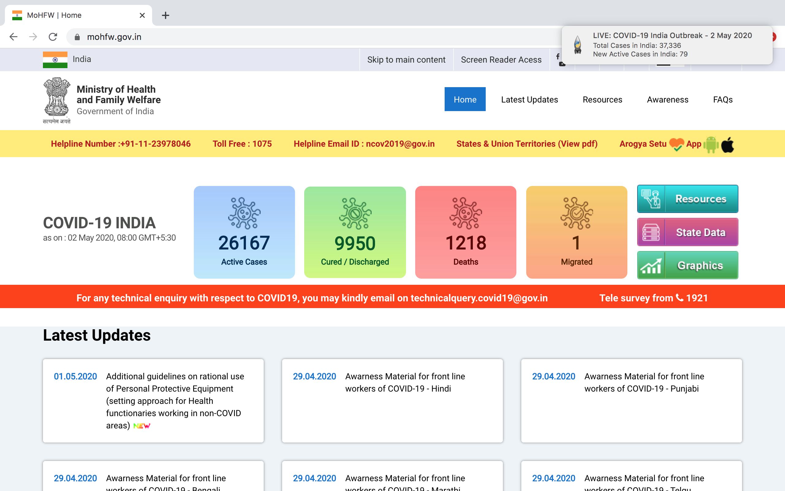

# Live-COVID19-Notifier
Displays live notifications related to COVID-19 cases in India as real time notification

<h1 align="center">LIVE: COVID-19 Notifier 😷</h1>
<p>
    
  
  <a href="https://github.com/itsfadnis/coronavirus-india/graphs/commit-activity" target="_blank">
    
  </a>
  <a href="https://twitter.com/HarshitPrasad8" target="_blank">
    
  </a>
</p>


## 📸 Screenshot


## Prerequisites

- Python 3.7

## 🚀 Usage

- Create virtual environment:

```sh
$ python3 -m venv Live-Covid19-Notifier
```

- Activate virtual environment:

```sh
$ source Live-Covid19-Notifier/bin/activate
```

- Run `requirements.txt` to install package dependencies:

```sh
$ pip install -r requirements.txt
```

## Author

👤 **Harshit Prasad**

* Twitter: [@HarshitPrasad8](https://twitter.com/HarshitPrasad8)
* Github: [@harshit98](https://github.com/harshit98)

## 🤝 Contributing

Contributions, issues and feature requests are welcome!

## Show your support

Give a ⭐️ if this project helped you!

## 📝 License

Copyright © 2020 [Harshit Prasad](https://github.com/harshit98).<br />
This project is [MIT](https://github.com/harshit98/Live-Covid19-Notifier/blob/master/LICENSE) licensed.
